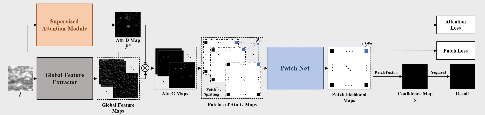

# Local-Patch-Network-with-Global-Attention
Official PyTorch implementation of the paper entitled 'Local Patch Network with Global Attention for Infrared Small Target Detection'.

## Network Architecture



## Dataset

Two widely used public dataset can be downloaded from following links and we thank the authors for their nice works.

SIRST dataset: https://github.com/YimianDai/sirst

MFIRST dataset: https://github.com/wanghuanphd/MDvsFA_cGAN

Specifically, you need to organize the data folders & files as follows:

``` shell
|
|--data/
|  |--MFIRST/
|  |  |--test/
|  |  |  |--00000.bmp
|  |  |  |--00001.bmp
|  |  |  |...
|  |  |  |--gt/
|  |  |  |  |--00000_gt.bmp
|  |  |  |  |--00001_gt.bmp
|  |  |  |  |...
|  |  |--train/
|  |  |  |--000000.bmp
|  |  |  |--000001.bmp
|  |  |  |...
|  |  |  |--gt/
|  |  |  |  |--000000_gt.bmp
|  |  |  |  |--000001_gt.bmp
|  |  |  |  |...
|  |--SIRST/
|  |  |--test/
|  |  |  |--Misc_6.bmp
|  |  |  |--Misc_8.bmp
|  |  |  |...
|  |  |  |--gt/
|  |  |  |  |--Misc_6_gt.bmp
|  |  |  |  |--Misc_8_gt.bmp
|  |  |  |  |...
|  |  |--train/
|  |  |  |--Misc_1.bmp
|  |  |  |--Misc_2.bmp
|  |  |  |...
|  |  |  |--gt/
|  |  |  |  |--Misc_1_gt.bmp
|  |  |  |  |--Misc_2_gt.bmp
|  |  |  |  |...
```

Please convert each mask to a binary image with only value 0 and 255, and name it as '[image name]_gt.bmp' before moving it into the 'gt' folder.

The division of training and testing set has been specified in the original dataset links and we just follow the authors' instruction.

## Requirements

``` shell
pip install -r requirements.txt
```

## Run

```shell
python main.py
```

## Citation

If you find this work useful for your research, please cite our [paper](https://ieeexplore.ieee.org/document/9735292):

```latex
@ARTICLE{9735292,
  author={Chen, Fang and Gao, Chenqiang and Liu, Fangcen and Zhao, Yue and Zhou, Yuxi and Meng, Deyu and Zuo, Wangmeng},
  journal={IEEE Transactions on Aerospace and Electronic Systems}, 
  title={Local Patch Network with Global Attention for Infrared Small Target Detection}, 
  year={2022},
  volume={},
  number={},
  pages={1-1},
  doi={10.1109/TAES.2022.3159308}}
```

## Acknowledgements

This work is supported by the National Natural Science Foundation  of China (No. 62176035, 61906025), the Natural Science Foundation of Chongqing, China (No. cstc2020jcyj-msxmX0835, cstc2021jcyj-bsh0155),  the Macao Science and Technology Development Fund under Grant (061/2020/A2), the Science and Technology Research Program of Chongqing Municipal Education Commission under Grant (No. KJZD-K202100606, KJQN201900607, KJQN202000647, KJQN202100646), the China Postdoctoral Science Foundation (No. 2021MD703940).
